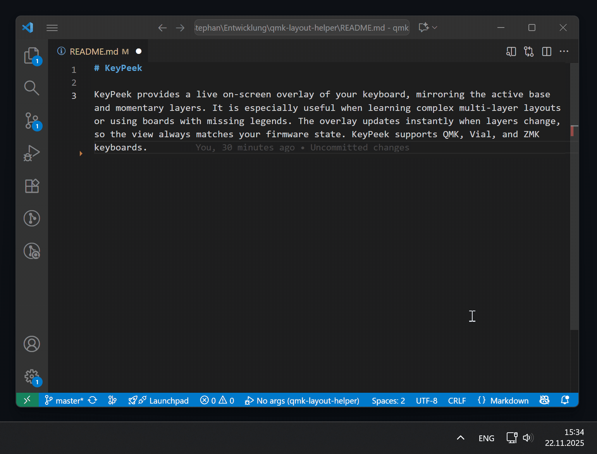
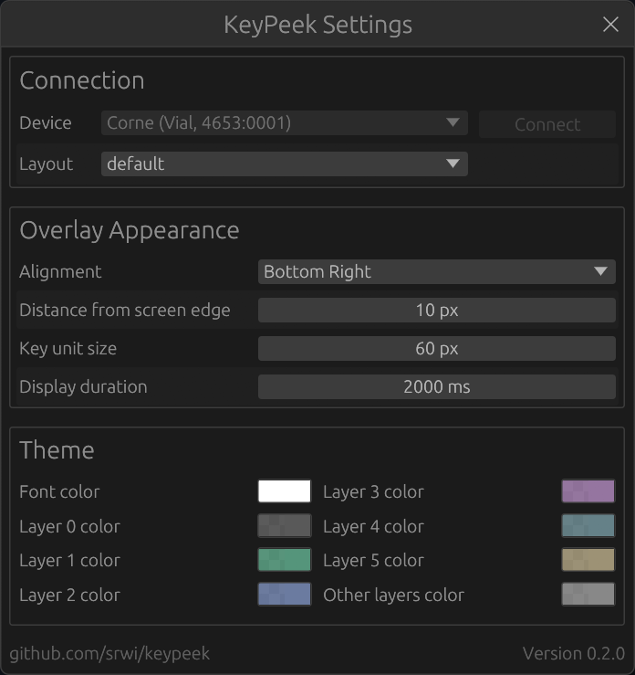

# wl-KeyPeek 

**wl-KeyPeek** is a Wayland-native GTK4 overlay that displays a live on-screen keyboard, mirroring your active base and momentary layers in real time. It's especially useful when learning complex multi-layer layouts or using boards with missing legends. The overlay updates instantly as you switch layers, keeping the view always in sync with your firmware state.

This is a modern rewrite of [the original KeyPeek project](https://github.com/srwi/keypeek) optimized for Wayland compositors with GTK4 and `gtk4-layer-shell`. It supports QMK, Vial, and ZMK keyboards and auto-discovers devices on startup.



## Setup

KeyPeek requires a small firmware module because stock QMK/Vial/ZMK firmware does not expose live layer-change events.
The module adds that event stream over the device connection, so the overlay stays in sync with your active layers in real time.

### QMK and Vial

1. In your QMK userspace (or `qmk_firmware`) root, add the module repo:
   
   ```sh
   mkdir -p modules
   git submodule add https://github.com/srwi/qmk-modules.git modules/srwi
   git submodule update --init --recursive
   ```
   
2. In your keymap folder, add `srwi/keypeek_layer_notify` to `keymap.json`:
   
   ```json
   {
     "modules": [
       "srwi/keypeek_layer_notify"
     ]
   }
   ```
   
3. In the same keymap folder, enable RAW HID and VIA in `rules.mk`:
   
   ```make
   RAW_ENABLE = yes
   VIA_ENABLE = yes
   ```
   
4. Build and flash your firmware:
   
   ```sh
   qmk compile -kb <your_keyboard> -km <your_keymap>
   ```
   
5. **QMK only:** Export layout information to `keyboard_info.json`:
   
   ```sh
   qmk info -kb <your_keyboard> -m -f json > keyboard_info.json
   ```
   
   This last step is only required for QMK keyboards, because VIA does not provide physical layout data directly over the connection. Vial keyboards do not require this step, as the layout data is transmitted when connecting the keyboard to KeyPeek.

### ZMK

1. Add the KeyPeek module to your `zmk-config/config/west.yml`:

   ```yaml
   manifest:
     remotes:
       - name: zmkfirmware
         url-base: https://github.com/zmkfirmware
       - name: zzeneg # <-- required for Raw HID module
         url-base: https://github.com/zzeneg
       - name: srwi # <-- required for KeyPeek module
         url-base: https://github.com/srwi
     projects:
       - name: zmk
         remote: zmkfirmware
         revision: main
         import: app/west.yml
       - name: zmk-raw-hid # <-- Raw HID module
         remote: zzeneg
         revision: main
       - name: zmk-keypeek-layer-notifier # <-- KeyPeek module
         remote: srwi
         revision: master
   ```

2. Add the `raw_hid_adapter` as an additional shield to your build, e.g. in `build.yaml`:
   
   ```yaml
   include:
     - board: nice_nano_v2
       shield: <existing shields> raw_hid_adapter # <-- required for Raw HID support
       snippet: studio-rpc-usb-uart # <-- required for ZMK Studio support
   ```
   
   **Note:** If you are using a split keyboard, the change above is only required for the central half.

3. Enable ZMK Studio support in your `.conf` file:
   
   ```conf
   CONFIG_ZMK_STUDIO=y
   ```
   
   If your keyboard does not support ZMK Studio yet, adding support is described in the [ZMK documentation](https://zmk.dev/docs/features/studio#adding-zmk-studio-support-to-a-keyboard).

KeyPeek will read layout and keymap directly from the device for ZMK without requiring additional configuration.

> [!NOTE]
> If the keyboard has been paired via Bluetooth before enabling raw HID support, re-pairing may be necessary to allow the new communication channel.

## Usage

Once the app is running (via systemd service or manual start), it automatically:
- **Discovers ZMK devices** on startup with full layout and keymap information
- **Hides the overlay** until you press a non-base layer key (stays hidden on base layer)
- **Shows/hides via tray icon** — click the tray icon to toggle visibility or quit

The overlay is transparent, click-through, and positioned to not interfere with your keyboard or monitor. Keyboard detection runs in the background, so the overlay stays in sync even if the app loses focus.

For **QMK/Vial keyboards**, you will need to provide layout information (see Setup section above). ZMK keyboards handle this automatically over the protocol.



## Installation & Running (Wayland)

This is a Wayland-native overlay built with GTK4 and `gtk4-layer-shell`. It works out-of-the-box on modern Wayland compositors.

### Quick Start

Build the release binary:

```bash
cargo build --release
```

Run it directly:

```bash
./target/release/keypeek
```

Or install to your local bin and run via systemd service (see below).

### Install as Systemd User Service

For convenience, install the binary and systemd user service:

```bash
install -Dm755 target/release/keypeek "$HOME/.local/bin/keypeek-wayland"
install -Dm644 resources/keypeek-wayland.service "$HOME/.config/systemd/user/keypeek-wayland.service"
systemctl --user daemon-reload
systemctl --user enable --now keypeek-wayland.service
```

Check status and logs:

```bash
systemctl --user status keypeek-wayland.service
journalctl --user -u keypeek-wayland.service -f
```

### Set Up Udev Rule (for ZMK/hidraw access)

If you're using ZMK and the app can't access your keyboard, install the udev rule:

```bash
sudo install -Dm644 resources/99-keypeek.rules /etc/udev/rules.d/99-keypeek.rules
sudo udevadm control --reload-rules
sudo udevadm trigger
```

Then reconnect your keyboard or restart the service.

# License & Attribution

Parts of this project are based on code from [the VIA project](https://github.com/the-via/app), which is licensed under the GNU General Public License v3.0.
